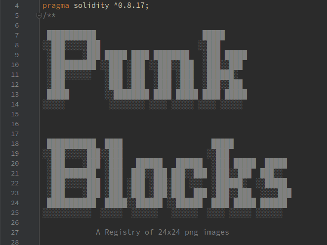

# PunkBlocks

This project deploys a contract to the Ethereum mainnet that can store 24x24 
blocks of punk attributes as png images.

Each block is numbered and indexed by its name.

A view function combines the attributes, outputting the composite image into
a single SVG image.

Anybody can register and store new punk block attributes, then use to create 
their own hybrid punks, or display the original punks. 

## Deployment

Ethereum Mainnet, contract's address: `0xf17Fbd2B05387ac32d8D0938Ee0C08684D80D6d2`

[Verified source](https://etherscan.io/address/0xf17Fbd2B05387ac32d8D0938Ee0C08684D80D6d2#code)


## Prior art, scope and purpose

Putting the CryotoPunks images on-chain is not new. In 2021, Larva Labs released 
a contract that sealed all 10,000 punks on chain, including their attribute 
lists.

"Punk Blocks" has a different scope and purpose. The difference is that 
"Punk Blocs" stores the images of the attributes, rather than their entire 
generated image. This allows the generation of entire punk images on-the-fly by 
calling the "view" methods of the Punk Blocks contract.

Another difference is that besides the original attributes, it is possible for 
anyone to add new attribute images to the contract, i.e. "Punk Blocks", and new 
unique punk images can be generated with these blocks. 
So, the scope of this contract is not to just store the original 10,000 punk 
images, but the punk images of an entire punk universe!

"Woah! Hold it... You are saying that we can now make unlimited number of punks, 
including new punks??!!" Yup. Although, these are only images, not tokens. 
This contract doesn't make any tokens, and there will always ever be 10,000 
punks.

Finally, some acknowledgments & thanks. "Punk Blocks" makes indirect use of the 
contract released by Larva Labs in 2021, to fetch a list of attributes that 
belong to a punk.

Naturally, this project would not have been possible without Larva Labs, so 
thanks to them for creating the punks & taking initiative to deploy the 
additional metadata on-chain. Also, thanks to 
[@samwilsn](https://github.com/samwilsn) who showed that it 
[is possible](https://binarycake.ca/posts/face-png/) to store png images and 
render them inside SVGs, and thanks to [@geraldb](https://github.com/geraldb) 
for providing a 
[handy sprite sheet](https://github.com/cryptopunksnotdead/punks.js)!


### Interface

```solidity
/**
* @dev svgFromPunkID returns the svg data as a string given a punk id
* @param _tokenID uint256 IDs a punk id, 0-9999
*/
function svgFromPunkID(uint256 _tokenID) external view returns (string memory);

/**
* @dev svgFromNames returns the svg data as a string
* @param _attributeNames a list of attribute names, eg "Male 1", "Goat"
*   must have at least 1 layer 0 attribute (eg. Male, Female, Alien, Ape, Zombie)
*   e.g. ["Male 1","Goat"]
*   Where "Male 1" is a layer 0 attribute, that decides what version of
*   image to use for the higher
*   layers (dataMale or dataFemale)
*/
function svgFromNames(string[] calldata _attributeNames) external view returns (string memory);

/**
* @dev svgFromKeys returns the svg data as a string
* @param _attributeKeys a list of attribute names that have been hashed,
*    eg keccak256("Male 1"), keccak256("Goat")
*    must have at least 1 layer 0 attribute (eg. keccak256("Male 1")) which
*    decides what version of image to use for the higher layers
*    (dataMale or dataFemale)
*    e.g. ["0x9039da071f773e85254cbd0f99efa70230c4c11d63fce84323db9eca8e8ef283",
*    "0xd5de5c20969a9e22f93842ca4d65bac0c0387225cee45a944a14f03f9221fd4a"]
*/
function svgFromKeys(bytes32[] calldata _attributeKeys) external view returns (string memory);

/**
* @dev svgFromIDs returns the svg data as a string
*   e.g. [9,55,99]
*   One of the elements must be must be a layer 0 block.
*   This element decides what version of image to use for the higher layers
*   (dataMale or dataFemale)
* @param _ids uint256 ids of an attribute, by it's index of creation
*/
function svgFromIDs(uint256[] calldata _ids) external view returns (string memory);

/**
* @dev registerBlock allows anybody to add a new block to the contract.
*   Either _dataMale or _dataFemale, or both, must contain a byte stream of a png file.
*   It's best if the png is using an 'index palette' and the lowest bit depth possible,
*   while keeping the highest compression setting.
* @param _dataMale png data for the male version, 24x24
* @param _dataFemale png data for the female version, 24x24
* @param _layer 0 to 12, corresponding to the Layer enum type.
* @param _name the name of the trait, Camel Case. e.g. "Luxurious Beard"
*/
function registerBlock(
    bytes calldata _dataMale,
    bytes calldata _dataFemale,
    uint8 _layer,
    string memory _name) external;
```

### Layers

Each registered block belongs to a Layer. A layer determines what order
the block gets applied when the SVG is rendered. "Base" is applied first, 
then a "Neck" block would be applied last.

There are 13 layers in total, numbered from 0-12. The attribute names shown in 
the comments below are examples from the default attribute set. 


```solidity
enum Layer {
    Base,      // 0 Base is the face. Determines if m or f version will be used to render the remaining layers
    Cheeks,    // 1 (Rosy Cheeks)
    Blemish,   // 2 (Mole, Spots)
    Hair,      // 3 (Purple Hair, Shaved Head, Pigtails, ...)
    Beard,     // 4 (Big Beard, Front Beard, Goat, ...)
    Eyes,      // 5 (Clown Eyes Green, Green Eye Shadow, ...)
    Eyewear,   // 6 (VR, 3D Glass, Eye Mask, Regular Shades, Welding Glasses, ...)
    Nose,      // 7 (Clown Nose)
    Mouth,     // 8 (Hot Lipstick, Smile, Buck Teeth, ...)
    MouthProp, // 9 (Medical Mask, Cigarette, ...)
    Earring,   // 10 (Earring)
    Headgear,  // 11 (Beanie, Fedora, Hoodie, Police Cap, Tiara, Headband, ...)
    Neck       // 12 (Choker, Silver Chain, Gold Chain)
}
```
### Adding new blocks.

New blocks can be added for any layer using the `registerBlock` function.
The block must consist of either a male attribute image data, or female data,
or both. With the exception that Layer 0 blocks **should** either contain male
attribute image data **or** female data, but **NOT both**.

If the block is a Layer 0 with *female* attribute image data present, then all 
higher blocks will be rendered with their *female* attribute image data, and 
vice-versa.

Preparing the png for upload can be tricky. It's best to use an **indexed 
palette** rather than an RGBA, using a single entry for the transparency,
with a low bit-depth. E.g. You could use a bit-depth of 2 if you have 4 colors,
or 4 if you have 16. 

You can use the [generator](./generator/) Go program as an example.
It reads some blocks from a source png file and breaks them down to 24x24
images. Each image is then saved as an optimized png, then the Solidity code 
is generated with the help of a sprite sheet data in a CSV format.

### License

MIT

Note: The MIT license is for the source code only. Images registered through
this contract retain their owner's rights, whatever they may be. This contract
is a non-profit "library" project and intended to archive & preserve punk
images, so that they can become widely accessible for decentralized apps,
including marketplaces, wallets, galleries, derivative works, research,
and other uses, as implied by fair-use or granted with permission from the
copyright owner.

# Demo

Here's a never-seen-before Alien with a Luxurious Beard and 3D Glasses.

